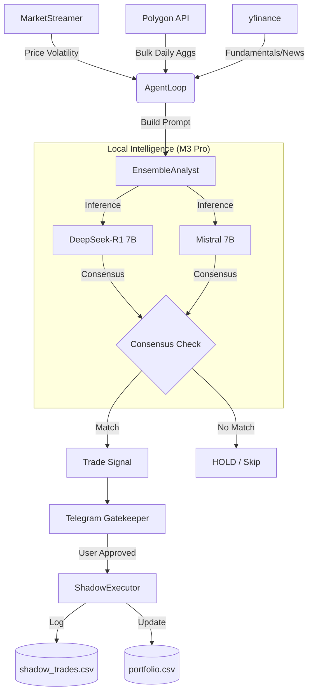

# System Architecture: AntiGravity Local Quant Agent

## Overview
AntiGravity is an autonomous trading system that combines local LLM reasoning (Dual-Model Ensemble) with objective quantitative metrics.

## Data Flow Diagram

## Component Definitions
- **MarketStreamer:** Background thread polling for 2% price moves across 100+ tickers.
- **EnsembleAnalyst:** Orchestrates two 4-bit quantized models via `mlx-lm`.
- **AgentLoop:** The "Silent Operator" that cycles every 4 hours to find new setups.
- **TradeGatekeeper:** Telegram-based Human-in-the-loop (HITL) approval system.
