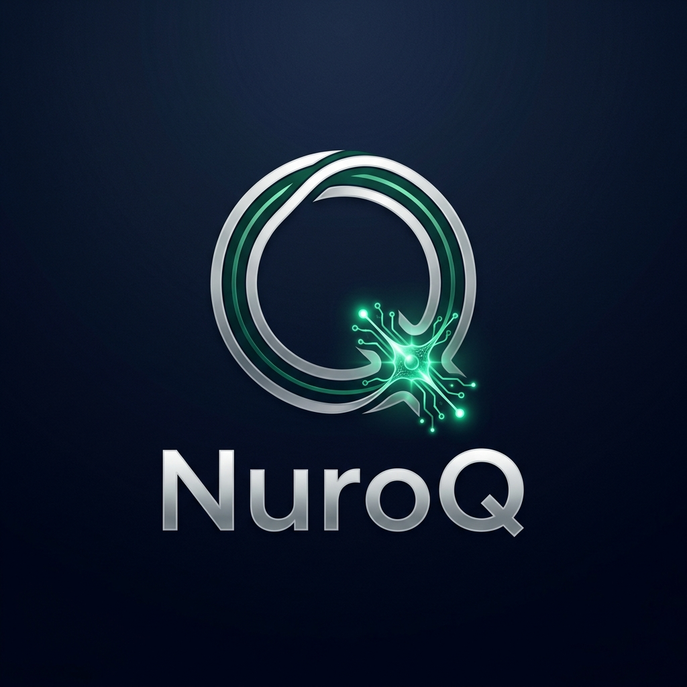

# 🧠 NuroQ — Frontier Neural Quant Workstation

**NuroQ** is a production-grade, autonomous trading workstation that combines **Ensemble Neural Analysis** with **Sovereign Agent Execution**. It is designed for high-frequency research and automated trading across US equities.



## 🚀 Key Features

- **🧠 Ensemble Neural Analysis:** Dual-model consensus (Mistral/Llama/DeepSeek) powered by MLX for institutional-quality reasoning.
- **📊 Interactive Financial Charts:** High-performance Plotly Candlestick charts with SMA20, Bollinger Bands, and dynamic volume overlays.
- **⚡ Real-Time Market Streamer:** Sub-second price updates via Alpaca WebSockets (IEX feed) for instant volatility detection.
- **🏎️ High-Performance Scanner:** Asynchronous parallel market scanning across ~12,000 tickers with prioritized filtering.
- **🗄️ Robust Data Layer:** Persistent SQLite database backend for signal history, portfolio tracking, and ACID-compliant trade logging.
- **🤖 Sovereign Agent:** Fully autonomous background loop that scans, analyzes, and executes shadow trades based on neural conviction.

## 🛠️ Architecture

- **`dashboard.py`**: The central mission control. Manages the Gradio UI, Agent loop, and Plotly visualizations.
- **`event_stream.py`**: The real-time data nerve center. Handles WebSocket connections and instant triggers.
- **`scoring.py`**: The quantitative engine. Computes technical indicators, hybrid scores, and position sizing.
- **`data_fetcher.py`**: The data acquisition layer. Optimized with parallel async fetching and exponential backoff retries.
- **`memory_module.py`**: The agent's persistent memory. Stores past decisions and reasoning to ensure long-term consistency.
- **`nuroq.db`**: The SQLite persistent store.

## 🚥 Quick Start

1. **Install Dependencies:**
   ```bash
   uv sync
   ```

2. **Configure Environment:**
   Create a `.env` file with your API keys:
   ```env
   POLYGON_API_KEY=your_key
   ALPACA_API_KEY=your_key
   ALPACA_SECRET_KEY=your_key
   TELEGRAM_TOKEN=your_token
   TELEGRAM_CHAT_ID=your_id
   ```

3. **Launch the Workstation:**
   ```bash
   uv run dashboard.py
   ```

## 📜 Signal Philosophy

NuroQ uses a **Hybrid Scoring** model (0-100):
- **Technicals (40 pts):** Trend confluence, RSI positioning, Relative Volume.
- **Fundamentals (30 pts):** Revenue growth, Valuation (P/E).
- **Bollinger + Vol (10 pts):** %B position and Volatility penalties.
- **Sentiment/Risk (10 pts):** Social sentiment and Earnings event risk.
- **AI Conviction (10 pts):** Neural ensemble consensus (Gated by Quant base score).

---
*Built with ❤️ by the NuroQ Engineering Team.*
