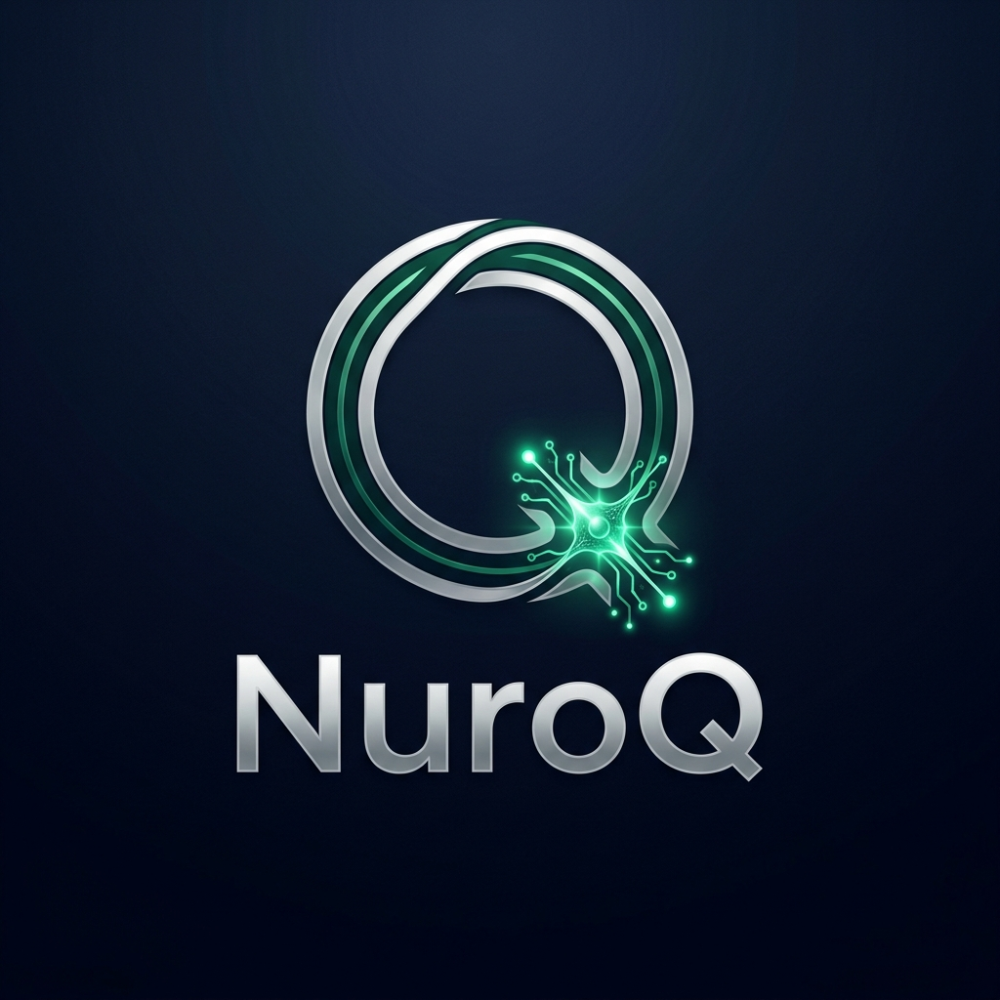

# 🧠 NuroQ — Frontier Neural Quant Workstation

**NuroQ** is an autonomous trading workstation that combines **Ensemble Neural Analysis** (Gemma 4B on MLX) with a **Sovereign Live Agent** that reacts to real-time bars. Built for US equities, paper-traded via Alpaca.



## What it looks like today

Two frontends share one Python backend:

| Surface | Stack | Status |
|---|---|---|
| **React web + iOS app** | Vite + React 19 + TypeScript + Tailwind + Capacitor 8 | Today view complete, 8 views placeholder |
| **Legacy Gradio dashboard** | Gradio 6 | Fully functional, refactored 2026-05-24 |

Backend: **FastAPI** wrapping the original Python compute layer (scoring, agent, Alpaca, MLX). One JSON API serves both frontends.

> **📖 New here?** Start with [`HANDOFF.md`](HANDOFF.md) for the most recent session summary.
> **🎨 Frontend dev?** See [`FRONTEND.md`](FRONTEND.md).
> **📱 iOS app?** See [`MOBILE.md`](MOBILE.md).
> **🚀 Publish to TestFlight / App Store?** See [`PUBLISHING.md`](PUBLISHING.md).
> **🏗️ Big picture?** See [`ARCHITECTURE.md`](ARCHITECTURE.md).
> **⏰ Cron / launchd?** See [`SCHEDULING.md`](SCHEDULING.md).
> **🤖 Train the LLM?** See [`TRAINING_GUIDE.md`](TRAINING_GUIDE.md).

## Key features

- **🧠 Gemma 4B local inference** (MLX, Apple Silicon) — gated to 10% of the final 100-point score
- **📊 Quant rubric** (90% of score) — momentum-aware %B, RSI, MACD, weekly trend, fundamentals
- **🎯 Live reactive agent** — minute-bar WebSocket from Alpaca, threshold crossings with hysteresis + cooldown
- **📰 News-shock cache invalidation** — BLOCK/WARNING headlines invalidate AI scores; LLM rescore queue runs fresh inference
- **📱 Telegram approval flow** — agent BUY crossings → tap to execute
- **💰 Alpaca paper trading** — bracket orders with stop loss + take profit
- **🩺 Health observability** — single-glance status pills (Agent / Stream / Telegram / Alpaca)
- **⚡ Quick Trade** — pinned bottom on desktop, FAB + sheet on iPhone
- **⌘K Command Palette** — type ticker or command, jump anywhere
- **🍎 Native iOS app** — splash, app icon, haptics, status bar theming, auto-refresh on foreground

## Architecture

```
┌──────────────────────────────────────────────────────────────────────────┐
│                          Python compute layer                            │
│  scoring.py · live_agent.py · event_stream.py · news_engine.py ·         │
│  alpaca_executor.py · data_fetcher.py · llm_queue.py · research_cycle.py │
│  ↓ unchanged across all UI iterations ↓                                  │
└──────────────────────────────────────────────────────────────────────────┘
              │                                            │
   ┌──────────┴────────────┐                  ┌────────────┴──────────────┐
   │ dashboard.py (Gradio) │                  │ backend/api.py (FastAPI)  │
   │ http://127.0.0.1:7860 │                  │ http://127.0.0.1:8000     │
   └───────────────────────┘                  └──────┬──────────────┬─────┘
                                                     │              │
                                              ┌──────┴──────┐  ┌────┴──────────────┐
                                              │ React SPA   │  │ iOS Capacitor app │
                                              │ frontend/   │  │ frontend/ios/     │
                                              └─────────────┘  └───────────────────┘
```

## Quick start

```bash
# Install Python deps
uv sync

# Configure .env with POLYGON_API_KEY, ALPACA_API_KEY, ALPACA_SECRET_KEY,
# TELEGRAM_TOKEN, TELEGRAM_CHAT_ID

# Run the React + FastAPI stack (recommended)
./scripts/dev.sh        # Vite 5173 + FastAPI 8000 with HMR
# or
./scripts/prod.sh       # Single port — FastAPI serves built SPA + API on 8000

# Run the legacy Gradio dashboard
NUROQ_FORCE_LIVE=1 ./.venv/bin/python dashboard.py    # port 7860

# Build & install on iPhone via Xcode
./scripts/ios.sh        # then Cmd+R in Xcode
```

## Signal philosophy

NuroQ scores every ticker 0-100 using a **deterministic quant rubric** with a **gated AI tiebreaker**:

| Component | Weight | Notes |
|---|---|---|
| **Technicals** | 40 pts | Trend confluence, RSI positioning, MACD, relative volume, momentum-aware %B |
| **Fundamentals** | 30 pts | Revenue growth, P/E valuation, profitability |
| **Bollinger + Vol** | 10 pts | %B position (breakout vs reversion) + volatility penalty |
| **Sentiment / Risk** | 10 pts | Social sentiment + earnings event risk |
| **AI Conviction** | 10 pts | Gemma 4B — **only if quant_base ≥ 40** |

**Thresholds:**
- BUY classification: final_score ≥ 60
- SELL classification: final_score ≤ 30 (asymmetric — wider HOLD zone prevents trigger-happy exits)
- Auto-trade Telegram gate: ≥ 65 (or ≥ 75 with earnings risk)

The AI is intentionally not allowed to dominate. If it disagrees with the quant base, the quant wins.

## Honest assessment

**Good for:** paper trading with disciplined signal generation · personal research sandbox · watching the system make decisions and learning what works.

**Not good for:** real money without an additional risk-review pass (paper mode is hard-coded in `alpaca_executor.py`) · cloud deploy as-is (MLX = Apple Silicon) · high-frequency anything (cycle is minutes, not milliseconds).

---

*Built with ❤️ on Apple Silicon.*
